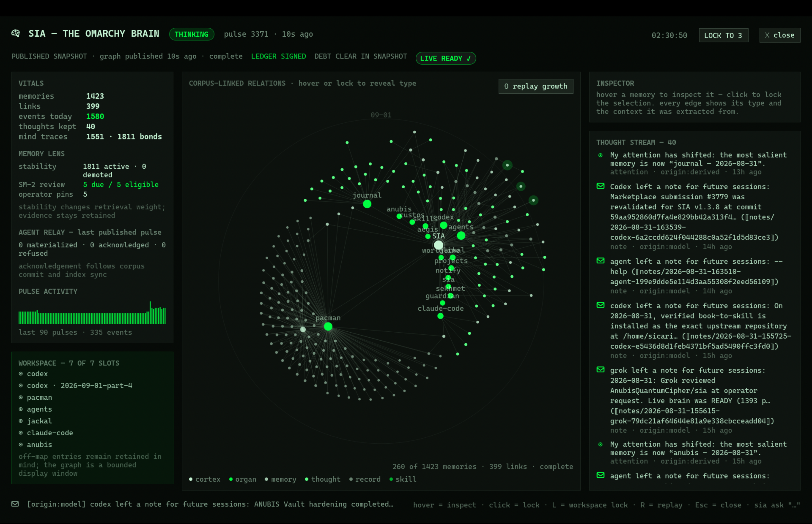

# SIA — the Omarchy Brain

“Brain” is a product metaphor for auditable local machine memory; it is not a
biological brain and does not establish cognition or neuroscience.

*Sia: the Egyptian personification of perception, who rode the solar barque
beside Hu and Heka.*

**Give your machine local memory.** SIA stores a persistent local corpus,
indexes it semantically, and compacts older day pages into weekly summaries.
A resident daemon
tails the evidence your machine already produces — package installs, journal
errors, git commits, optional Git-backed Obsidian vault records, agent
sessions, notifications, and any log you point it at — into a git-versioned
markdown corpus, indexed into a typed knowledge graph with **local**
embeddings. It retains, links, and retrieves admitted memories, and runs a
deterministic nightly maintenance and compaction cycle. It helps you propose and
commit falsifiable predictions, then records how they are graded. You can
watch its generated-entry stream and query the memory it has admitted.

You can audit every stored word because the corpus is markdown in git and the
daemon signs its own acts.

**Current release: v1.7.8.** The nightly judge audit had reported the same
score for five days, and reading it as a limit of the grader was comfortable
and wrong. SEKHMET really did restart wireplumber last August — four times,
signed in its own ledger — and SIA ingested those rows as evidence and then
deleted the page during a maintenance pass. Epoch exemplars were sampled by
position, so the weekly summary kept the *intent* to heal and dropped every
record that it *worked*; and the grading lane sorted both evidence lanes by
path, so `epochs`
sorted ahead of `events` and the epoch was never shown to the judge at all.
Both are fixed, and so is a third: evidence excerpts took a page's first
420 characters, which on an epoch is its frontmatter, so the judge was handed
metadata and no evidence. And a fourth: both lanes cite the same page, and the excerpt was chosen
first-wins, so a 220-character head beat the window that carried the answer.
The audit that had scored 1/2 since it was written now scores 2/2 on the
installed runtime. Twenty-one tests fail on a revert. The compacted
originals were in git throughout; what changed is what live memory can answer
from.

Automatic Continuity never wakes the computer solely to run a backup. Its
persistent timers catch up after the user session returns, serialize their
work, and coalesce duplicate scheduled requests. The hourly job creates an
encrypted recovery snapshot; the weekly job performs the deeper repository
check and exact off-path restore verification. Inspect the live schedule at
any time with `sia backup schedule`.



Example SIA cockpit. This static preview is not current machine state, a live
readiness result, or evidence of cognitive performance.

## Install (Omarchy)

SIA is already listed in the
[Omarchy Plugin Marketplace](https://plugins.omarchy.org/plugin.html?id=khephri.sia).
Add its public plugin checkout with Omarchy's standard command:

```bash
omarchy plugin add https://github.com/AnubisQuantumCipher/sia.git --enable
```

The enabled surface detects that the resident memory service is absent and presents a
**SETUP** gate. Open the cockpit from the SIA bar item and choose **Begin
first light**. That explicit action asks this desktop to open a terminal and
run SIA's fail-closed `install.sh` in it — loading or enabling the QML never
runs the installer by itself. SIA holds that terminal open when the installer
finishes, on success and on a named refusal; the cockpit reports whether the
installer shell was actually observed to start and, once it has, steps aside so
that terminal is in front. First light is substantial: it downloads pinned
local toolchains and the embedding runtime, builds gbrain, pulls the pinned
local embedding model, creates this machine's signing identity and empty
corpus, and installs user services. Review the disclosure in the gate before
continuing.

Installation is complete only when the installed runtime version matches the
plugin, the first-light pulse publishes, and `sia ready` passes; until then
the cockpit stays gated. After `omarchy plugin update khephri.sia`, an older
resident runtime produces an **UPDATE** gate whose **Finish update** action
runs the same visible installer. An interrupted or ambiguous generation is
labeled **REPAIR** instead of being guessed; a resident record newer than the
checkout shows **AHEAD** and disables installation.

Community plugins run unsandboxed as your user, and the git-URL form clones
the current upstream branch rather than the commit last verified by the
Marketplace — inspect the checkout before pressing the setup button. See the
[official development guide](https://plugins.omarchy.org/develop.html).

**Privacy at install and after:** ingestion, indexing, retrieval, and
embedding make no cloud calls. The judge is disabled by default; only if you
explicitly configure a Claude model does that separate tool-free CLI path send
the recalled context you ask it to judge. Configured Codex CLI grading refuses
because its documented read-only sandbox still permits reads. An MCP consumer
is an operator-configured trust boundary: it receives the memory it requests
over stdio and may forward that content to its own model/provider — the same
boundary applies to any script or agent that captures `sia` CLI output.

## The whole system, in one view

SIA is an owner-local, evidence-grounded memory architecture — not a cloud
assistant and not an opaque database. The corpus pages, retained non-page
migration provenance, and their Git history are the source of truth;
gbrain/PGLite, local embeddings, and the cockpit
graph are rebuildable projections. The resident **brainstem** alone
materializes agent notes, and it publishes a generation only after the corpus
is committed, index sync succeeds, and graph export succeeds; otherwise
memory-dependent reads refuse with named projection debt instead of
presenting stale memory as current.

```text
machine evidence + explicit owner / agent notes
          │  bounded senses · redaction · origin labels · immutable note queue
          ▼
git-versioned corpus + retained provenance  ← source of truth / recoverable history
          │  one SIA-managed PGLite lease · publication barrier · live readiness gate
          ▼
local gbrain + PGLite + Ollama embeddings  ← rebuildable index + typed graph
          │
          ├── Quickshell cockpit + bar widget
          ├── local `sia` CLI
          └── stdio MCP tools and resources for resident agents

Ed25519 hash-chained lifecycle ledger: signed transitions and results
```

| System layer | What SIA does now | What it does **not** silently claim |
|---|---|---|
| **Evidence and integrity** | Ingests bounded machine records and explicit notes; redacts secret-shaped spans; keeps `evidence`, `derived`, `model`, and `legacy-unlabeled` origins distinct; signs its lifecycle ledger; and gates memory-dependent reads behind `sia ready`. | Recall absence is never evidence of absence. A published graph snapshot is not a live readiness verdict. |
| **Local retrieval policy** | Builds local semantic recall and a typed graph; applies origin-weighted hybrid-query ranking, usage salience, co-return reinforcement, an optional graph reranker, novelty and intake-surprise scoring, a bounded attention window, weekly epoch compaction, stability decay, pins, and SM-2 scheduling. | These are deterministic policies and lexical link inferences — not evidence of human-like mental processes or real-world relationships. |
| **Dated intents** | Keeps operator-created `sia intend` commitments, surfaces them as deadlines approach, and closes them only on the operator's word; a nightly slug-retrieval drift tripwire signals when to run the full benchmark. | It does not infer task completion, and its drift signal is a heuristic — not an answer-quality score. |
| **Prediction calibration** | Lets people commit future-dated predictions; optionally obtains tool-isolated evidence judgments; records signed grades and population-aware descriptive Brier calibration; and runs `sia bench`, a signed-ledger QA benchmark that scores abstention. | Calibration is not a representative population claim, and `sia bench` is a local regression instrument. |
| **Resident agents** | Exposes local memory through bounded stdio MCP tools/resources and `sia context` packs. Agents queue immutable note requests; the brainstem alone materializes and indexes them before acknowledgement. | Agents never receive a database handle. Their notes remain `model`-origin prose, and each MCP consumer is its own disclosure boundary. |
| **Mission control** | Presents the graph, generated-entry stream, evidence chain, source health, memory lens, agent relay, and an on-demand live-readiness check in the Quickshell cockpit. | The cockpit labels last-published diagnostics separately from an explicit live check, and labels bounded display omissions rather than implying memory is missing. |
| **Continuity** | Freezes the documented SIA roots into a signed portable capsule, verifies repository copies by exact off-path round trip, and thaws only through a journaled, receipt-preserving restore ceremony. | The private signing key and `.gbrain` are not in routine capsules. No repository is pruned automatically, and a same-disk copy is not disaster protection. |

**New here?** [Install](#install-omarchy) ·
[Try it](#sixty-seconds-after-install) ·
[Field Manual](docs/MANUAL.md) · [Whitepaper](docs/WHITEPAPER.md)

## What you get

- **A corpus that accretes.** Every admitted event becomes a durable record in
  a git-versioned day page; the corpus is authoritative and the database is a
  rebuildable index — wired into a typed knowledge graph by
  [gbrain](https://github.com/garrytan/gbrain) with local
  `nomic-embed-text:v1.5` embeddings via Ollama. When a schema pack is unsafe
  or a projection fails, the affected edges degrade honestly and publication
  debt keeps memory-dependent reads closed until a pulse publishes a complete
  snapshot. The exact two-lane link-inference rules and their refusal behavior
  are specified in the [Field Manual](docs/MANUAL.md).
- **A policy layer, not just an index.** Deterministic policies adjust local
  retrieval: usage salience decays with time and grows with world-originated
  use; co-return edge weights increase when memories are returned together,
  with nightly decay and degree caps; graph propagation uses Personalized
  PageRank, measured on the tripwire probes and currently
  default-off in `sia ask` because the extended set showed it trailing
  the unmodified hybrid query — the whitepaper records the numbers and the
  re-promotion condition; a non-destructive
  stability lens demotes stale associations without deleting evidence, while
  safety-priority or operator-pinned pages follow a nightly SM-2 scheduling
  schedule; novelty and unusual sampled event intake produce generated notices
  without treating unobserved hours as source silence; a seven-entry attention
  window holds recently used memories; old day pages compact into weekly epoch
  summaries while declared safety-class days remain verbatim. Every compacted
  original remains recoverable in git.
- **Prediction calibration.** Register falsifiable predictions with confidence and
  strictly future UTC deadlines; a tool-free Claude judge (off by default)
  grades them strictly against recalled evidence without seeing your
  confidence — TRUE / FALSE / UNRESOLVABLE, abstention audited. Calibration
  reports are population-aware: a lone grade is labeled a single case, sparse
  bins are withheld, and the series stays descriptive because takes are not a
  random sample. Agents may *propose* predictions; only you commit them.
- **Dated intents.** `sia intend "rotate the keys" --by 2026-10-01`:
  commitments SIA surfaces as deadlines near and marks urgent when
  overdue, closing only on your word — a diary lane with no scoring and no
  model.
- **A mission-control cockpit.** A full-screen Quickshell overlay (from the
  bar widget, or `SUPER+SHIFT+B` when you opt into the binding): the animated
  graph with radial time, stable semantic sectors, collision-aware labels,
  replayable outward growth, hover neighborhoods, edge explanations, origin
  labels, a generated-entry stream, evidence-chain verdicts, and a SOURCE HEALTH truth
  boundary that admits incompleteness instead of hiding it. Its truth ribbon
  separates the last-published snapshot from an explicitly requested live
  `sia ready` check, and a reversible workspace lock keeps the cockpit on one
  focused Hyprland workspace. Plus a bar widget with the live event count.
- **Agents everywhere.** An MCP server for the documented Claude Code, Codex
  CLI, and Grok integrations (plus compatible stdio MCP clients), and a skill
  for skill-reading harnesses. Tools cover reinforcing recall, a read-only
  search lane for audits, and carefully labeled writes; resources mount
  status, generated entries, calibration, the root page, and
  `sia://memory/{slug}` pages (`thoughts` and `cortex` remain compatibility URIs).
  The clean client-visible tool surface is `sia.ask`, `sia.search`,
  `sia.recall`, `sia.status`, `sia.think`, `sia.note`, `sia.propose_take`, and
  `sia.calibration`; reconnect the client or open a new agent session after an
  update so cached MCP discovery is refreshed.
  Notes persist and may be returned to configured consumers, so do not put
  credentials, secrets, or private content in them; pattern-based redaction is
  defense in depth, not a secrecy guarantee.
- **Evidence culture.** SIA keeps its own Ed25519 hash-chained run ledger;
  every `sia ask` answer carries a truth-boundary line and one of the three
  canonical origin labels: `evidence` / `derived` / `model`. Ambiguous legacy
  origin metadata surfaces as the explicit `legacy-unlabeled` boundary, never
  promoted to evidence. Judge grades, ponder output, and agent/operator notes
  are `model` and never mint facts. Secret-shaped spans are redacted at the
  sense boundary; *absence of recall is never evidence of absence*.

### The historian is the product; policy evaluation is the research program

The historian half — origin-labeled capture, the git corpus, local recall,
the signed ledger, the cockpit — is shipped, tested behavior you can use
today. The candidate policy layer — usage salience, co-return reinforcement,
graph propagation, novelty scoring, a bounded attention window, stability,
and rehearsal — is shipped as deterministic behavior, and the
[whitepaper](docs/WHITEPAPER.md) is explicit about its evidentiary status:
the associative tie-breaker matched the unmodified hybrid query on the historical probe
set and did not beat it, and this release contains no controlled evidence
that rehearsal improves answer quality. The policies are explicit hypotheses
with instruments attached (`sia bench`, the nightly drift tripwire, the
calibration record), not established improvements. Keep evidence and model
separate in the docs the way the corpus keeps them separate in memory.

## Sixty seconds after install

```bash
sia status                          # current source and memory-index state
sia ready                           # exit nonzero unless memory is reconciled
sia ask "what happened today"       # semantic recall, cited + labeled
sia think                           # recent generated entries
sia context                         # bounded handoff pack for agents/sessions
sia take "the build will go green" --confidence 0.8 --by 2026-09-05
sia intend "rotate ledger keys" --by 2026-10-01   # dated commitment
sia note "hard-won context" --from me    # a memory for future sessions
sia memory                          # stability, pins, and reviews due
sia memory --pin organs/journal     # protect/qualify a page for rehearsal
sia calibration                     # population-aware descriptive scorecard
sia bench generate --out /tmp/sia-qa  # signed-ledger QA + private MCP eval
sia backup status                   # continuity adapter and verified-copy state
sia backup schedule                 # authenticated automatic-timer state
```

Point it at your own programs in `~/.config/sia/config.json`:

```json
{ "custom_senses": [
    { "name": "myapp", "path": "~/logs/app.log", "type": "lines",
      "match": "ERROR|FATAL", "kind": "error", "tags": ["failed"] } ] }
```

`match` takes a bounded list of literal substrings separated by `|`;
regular-expression operators are refused so a configured pattern cannot
monopolize the resident writer. For `type: "jsonl"`, SIA admits only the
exact configured `field`. A real Git repository at `~/Obsidian` is discovered
as an optional source adapter with no configuration; for a different vault path, skill
discovery roots, and judge settings, see the
[Field Manual](docs/MANUAL.md) — then restart the brainstem and check
`sia status`.

## Requirements

Linux (Omarchy/Arch tested; x86_64 or aarch64) with procfs mounted at `/proc`
and kernel support for pollable pidfds, child-subreaper adoption, and sealed
memfd files. `python3` must expose `os.pidfd_open`, `signal.pidfd_send_signal`,
`os.waitid` with `waitid/WNOWAIT/WSTOPPED`, and `os.memfd_create`, and must have
an Ed25519-capable Python-cryptography. The native lifetime owner also requires
Linux `SCM_CREDENTIALS` and `SCM_RIGHTS`; absence of any core lifetime feature
refuses before the mutating shell launches. SIA also requires `git`, `curl`, `tar`,
`unzip`, `bzip2`, `sha256sum`, `zstd`, `flock`, `ss` from `iproute2`, a systemd
user session (`systemctl`), and roughly 2 GB of disk for Ollama. The bootstrap
downloads Bun, Ollama, and SIA's private restic executable from pinned release
URLs and verifies their published SHA-256 digests before extraction; it checks
out the full gbrain commit in `GBRAIN_PIN`, verifies the pinned `bun.lock`,
installs with `--frozen-lockfile`, compiles the executable, and receipts the
result. Managed filesystems must support atomic rename and
`renameat2(RENAME_NOREPLACE)`; the share filesystem must support `O_TMPFILE`
for crash-closed signed-ledger publication — the installer probes both before
activating anything. Optional: the Omarchy 4.x shell for the cockpit. Judge
calls remain off until you set `judge.backend` to `claude` with an explicit
`judge.model`.

## Install, recovery, and removal boundaries

The short version of the contract; the full mechanics are in the
[Field Manual](docs/MANUAL.md) and each release's
[CHANGELOG](CHANGELOG.md) entry.

- **Failures stay loud and recoverable.** Before any dependency mutation, a
  durable launch fence binds the old CLI, brainstem, and MCP launchers and
  sets them to mode `000` so nothing enters through a stale launcher
  mid-upgrade. A failure after the first installer mutation deliberately
  leaves the brainstem disabled and stopped instead of restarting it against
  mixed dependencies — fix the reported cause and rerun `install.sh`. Prior
  runtime and plugin trees are retained at printed hidden sibling paths.
- **Readiness is a live gate.** Memory-dependent commands hold the corpus
  lease from the readiness check through the returned result, keeping the
  answer in the same corpus generation, and report `SIA memory read refused`
  until a successful `sia pulse` reconciles named publication debt. The
  `sia status` readiness line is live; pulse/graph fields are last-published
  snapshots. Never delete a `sync_needed` marker or a pending
  `grade-transactions` journal to "fix" readiness.
- **Corpus creation and adoption are attributed transitions**, not
  directory-shape guesses: an absent corpus is assembled off-path and advances
  through `prepared`/`publishing`/`published` under a durable
  `managed-install/corpus-bootstrap` record; adoption writes a
  `corpus-adoption` receipt bound to the directory's stable identity. An
  unreceipted corpus is recognized as legacy SIA only when `.git/` is real,
  `README.md` contains the exact marker line
  `# SIA corpus — this machine's memory`, and `bin/sia-ledger verify` accepts
  the share tree; other nonempty corpora require explicit
  `SIA_ADOPT_EXISTING_CORPUS=1` consent. The runtime receipt hashes only the
  allowlisted shipped members; it does not attest to extra entries. Preserve
  an interrupted bootstrap or adoption record and rerun the installer —
  deleting it does not grant adoption authority.
- **The signed ledger initializes as an exact prefix**:
  `key.hex`, then the matching `pub.hex`, then one canonical signed
  `GENESIS:init` row in `ledger.tsv`, then the matching `head.pin`. Any other
  combination refuses
  closed; do not delete or recreate individual ledger components.
- **The gbrain store bootstraps through its own supported front door** under a
  durable `managed-install/gbrain-bootstrap` transition. Because gbrain
  records an absolute `database_path`, the authenticated probing phase
  generation-CAS rebinds only the exact private bootstrap path to the
  canonical `brain.pglite` path before the final health probe (the fix for
  [issue #2](https://github.com/AnubisQuantumCipher/sia/issues/2)). Unhealthy
  or unattributed stores are preserved and refused; direct `.gbrain` rebuilds
  are unsupported.
- **Continuity restores are ceremonies, not copies.** Restore preserves the
  installed destination `.gbrain` root, config, schema pack, managed receipt,
  and unknown children, rebuilds only the PGLite projection through gbrain,
  and turns green only after a fresh correlated health, ledger, and adoption
  proof. SIA's private restic adapter uploads a verified capsule hourly and
  round-trip-verifies weekly; it never prunes, and routine capsules exclude
  the private signing key. See [Continuity](docs/CONTINUITY.md). (In this
  repository SIA means only the Omarchy Brain product — not the Sia Foundation's
  `sia.tech` storage network.)
- **Plugin enablement refuses rather than guesses**: the installer requires an
  exact `khephri.sia` catalog entry after a rescan and refuses
  malformed/non-list JSON; a stale Quickshell entry after uninstall is cleared
  with `omarchy-shell shell rescanPlugins`.

## Documentation

- [**Field Manual**](docs/MANUAL.md) — cockpit tour, full CLI, generated-entry
  glyphs, configuration, the exact operating and recovery paths,
  troubleshooting.
- [**Continuity**](docs/CONTINUITY.md) — signed portable capsules, storage
  adapters, automatic verification, and clean-machine restore.
- [**Whitepaper**](docs/WHITEPAPER.md) — architecture, the evidence model,
  every candidate policy with its formula and literature ancestry, the
  measurement instruments, and the verification record.
- [**Roadmap**](ROADMAP.md) — the measured state of every instrument, the
  feature freeze and its exit gates, the module-split schedule, and the
  v2.0 decision rule for the candidate-policy lane.
- [**CHANGELOG**](CHANGELOG.md) — the complete release history. Recent
  highlights: the v1.5.1 rehearsal-grading fix with its real-gbrain contract
  test lane ([issue #3](https://github.com/AnubisQuantumCipher/sia/issues/3)),
  v1.5.0 marketplace-native guided first light, the v1.4.2 fresh-bootstrap
  recovery reported by [@m10ust](https://github.com/m10ust), and the v1.4.1
  optional Obsidian source adapter proposed by
  [@webdevtodayjason](https://github.com/webdevtodayjason).

### Omarchy marketplace status

SIA is listed as
[`khephri.sia`](https://plugins.omarchy.org/plugin.html?id=khephri.sia).
Omarchy has no install/update/remove lifecycle hooks, so SIA presents an
explicit cockpit gate and, only after you press the setup/update button, asks
the desktop to open a terminal running `install.sh`; the cockpit reports
whether that installer shell actually started. The Marketplace page may continue to
display **Manual setup** until a maintainer removes its registry override;
that catalog label does not change the repository's guided flow. Every release
is validated locally with `omarchy plugin validate .` and listing updates go
through the marketplace's newer-upstream-commit verification path.
Marketplace validation and listing are not security reviews.

## Remove

Run the uninstaller from the plugin/repository directory:

```bash
./uninstall.sh           # removes code/UI; keeps corpus, ledger, keys, queues, config
./uninstall.sh --purge   # also attempts to erase retained SIA data and config
```

On success, either path disables the Quickshell surface
and archives the plugin checkout, so a later `omarchy plugin remove` is
normally unnecessary.
A plain `omarchy plugin remove khephri.sia` used first removes only the
checkout; it does not uninstall SIA's resident runtime or user service, and it
removes the normal entry point for that teardown.

Default removal preserves the data categories — corpus, ledger, signing
identity/head, queues and state snapshots, research, private toolchain, and
operator config — not byte-for-byte intact directory trees; it archives the
active plugin tree to a printed hidden sibling path instead of deleting
possible local additions. Ollama, its user service, and the local model
remain because they may be shared. If the brainstem cannot be stopped,
removal preserves its runtime and unit, and `--purge` is blocked rather than
deleting memory under a possibly live daemon; surviving or indeterminate
service/plugin/MCP consumers likewise block purge, while an
unrelated mismatched MCP registration is preserved without retaining SIA's
runtime.
`--purge` is destructive but not transactional: it attempts the state, share,
and config root removals independently with no rollback — back up every
retained category first and inspect the aggregate result. Review
`uninstall.sh` before using `--purge` if the corpus or signing keys have not
been backed up.

## What this is (and is not)

A local, git-versioned, origin-labeled memory that refuses to pretend a
language model is a witness. It is a disciplined machine-event historian with
a small semantic index and a cockpit. Product policy names
describe deterministic behavior; literature ancestry is kept in Credits and
References and is not a warrant for stronger claims.

## Honesty principles (the actual design)

1. Every recall answer (`sia ask`/search) declares its origin and truth boundary.
2. Absence of recall is not evidence of absence.
3. A system that fails open must say so (SOURCE HEALTH).
4. The model may summarize and grade — never mint facts. Its grades, ponder
   output, and agent/operator notes remain `model` even where SIA separately
   applies deterministic transition or Brier arithmetic.
5. Records, not content: built-in senses use metadata and evidence streams;
   secrets are redacted at ingest, and built-in senses never open agent message
   bodies, clipboards, or private keys. Operator-configured custom senses read
   the file/field explicitly named in config and must not target secret or
   content stores. The separate ledger keeper necessarily reads SIA's own
   signing key when it signs an authorized transition.
6. SIA does not silently delete or guess: weekly compaction is git-recoverable,
   named lifecycle transitions (boot, pulse ingests, maintenance runs, and grades) are
   ledgered, and refusal/partial states remain explicit. Graph read/export
   failures are visible in SOURCE HEALTH; a pulse that cannot publish its graph
   records the signed result `graph-fail`.

## Credits

Built on [gbrain](https://github.com/garrytan/gbrain) by Garry Tan.
The fresh-machine bootstrap recovery was reported by
[@m10ust](https://github.com/m10ust) in
[issue #2](https://github.com/AnubisQuantumCipher/sia/issues/2); the optional
Git-backed Obsidian source adapter was proposed by
[@webdevtodayjason](https://github.com/webdevtodayjason) in
[issue #1](https://github.com/AnubisQuantumCipher/sia/issues/1).
Candidate-policy ancestry includes Anderson (ACT-R), Collins & Loftus, Nader,
Lisman & Grace, McGaugh, McClelland/McNaughton/O'Reilly, Dehaene, and to
HippoRAG, Generative Agents, Zep, and Letta — citations in the whitepaper;
the names are ancestry, the behavior is the contract.

MIT © 2026 Khephri Labs
