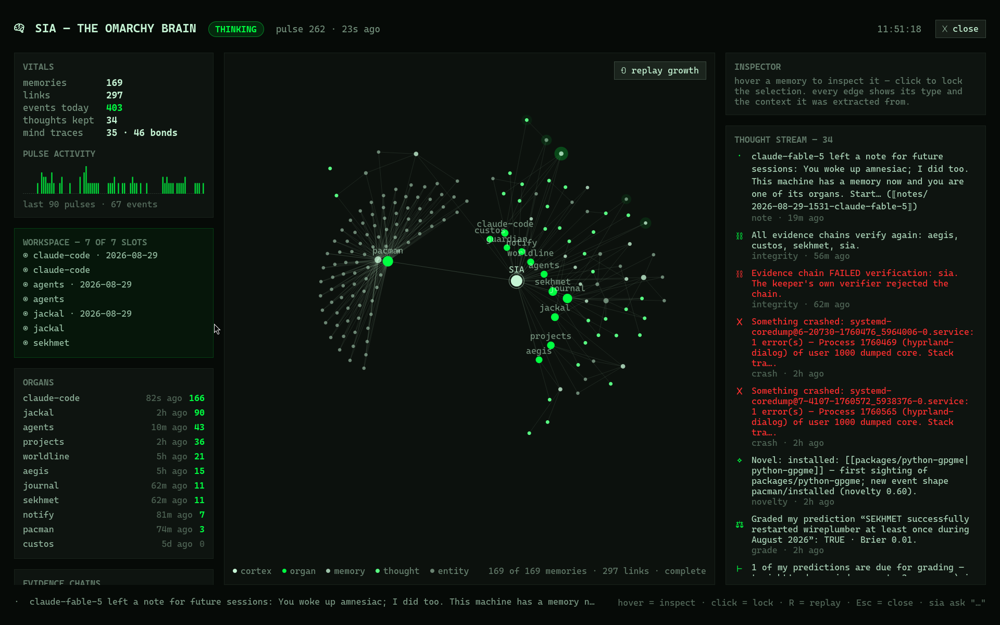

# SIA — the Omarchy Brain

*Sia: the Egyptian personification of perception, who rode the solar barque
beside Hu and Heka.*

**Give your machine a memory.** SIA is a persistent, associative,
self-consolidating memory system for your Linux desktop. A resident daemon
tails the evidence your machine already produces — package installs,
journal errors, git commits, agent sessions, notifications, and any log
you point it at — into a git-versioned markdown corpus, indexed into a
typed knowledge graph with **local** embeddings. It retains, links, and
retrieves admitted memories, and runs a deterministic nightly
"dream" consolidation cycle. It helps you propose and commit falsifiable
predictions, then records how they are graded. You can watch its thought stream
and ask it about the memory it has admitted.



## Install (Omarchy)

SIA is already listed in the
[Omarchy Plugin Marketplace](https://plugins.omarchy.org/plugin.html?id=khephri.sia).
Add its public plugin checkout with Omarchy's standard command:

```bash
omarchy plugin add https://github.com/AnubisQuantumCipher/sia.git
```

When Omarchy asks whether to enable the plugin immediately, choose **No**.
The git-URL form clones the current upstream branch; it is not pinned to the
commit last verified by the marketplace. Inspect the checked-out commit and
the listing's verification state before running code from it.
Then install the resident brainstem, CLI, private toolchain, and user services:

```bash
~/.config/omarchy/plugins/khephri.sia/install.sh
```

Do not add `--enable` on first install. The installer runs first light, checks
`sia ready`, and enables the desktop surface only after the brain is ready.
Omarchy's current plugin command has no install hook, so the explicit second
command is required; silently launching it from QML would violate the plugin
manager's trust boundary. Community plugins run unsandboxed as your user, so
inspect the source before installation. See the
[official development guide](https://plugins.omarchy.org/develop.html).

The memory-content runtime stays on your machine: ingestion, indexing,
retrieval, and embedding make no cloud calls. The judge is disabled by default.
If you explicitly configure a Claude model, that separate tool-free CLI path
may send the recalled context you ask it to judge or synthesize. It runs with
built-in tools, MCP, customizations, session persistence, and project discovery
disabled from an empty directory.
Configured Codex CLI grading refuses because its documented read-only sandbox
still permits reads and currently exposes no documented no-tool mode.
An MCP consumer is another operator-configured trust boundary: it receives the
memory it requests over stdio and may forward that content to its own
model/provider, whose data terms apply. The same boundary applies to scripts,
pipes, and agents that capture memory printed by the local `sia` CLI; SIA
cannot control what those callers do with returned content.

## SIA today: the whole system, in one view

SIA is an owner-local, evidence-grounded memory architecture — not a cloud
assistant and not an opaque database. The Markdown corpus and its Git history
are the source of truth; gbrain/PGLite, local embeddings, and the cockpit graph
are rebuildable projections. Every SIA-managed PGLite operation shares a
single-owner lease, and the resident **brainstem** alone materializes agent
notes. It publishes a generation only after the corpus is committed or verified
clean, index sync succeeds, and graph export succeeds; otherwise
memory-dependent reads refuse with named projection debt instead of presenting
stale memory as current.

```text
machine evidence + explicit owner / agent notes
          │  bounded senses · redaction · origin labels · immutable note queue
          ▼
git-versioned Markdown corpus  ← source of truth / recoverable history
          │  one SIA-managed PGLite lease · publication barrier · live readiness gate
          ▼
local gbrain + PGLite + Ollama embeddings  ← rebuildable index + typed graph
          │
          ├── Quickshell cockpit + bar widget
          ├── local `sia` CLI
          └── stdio MCP tools and resources for resident agents

Ed25519 hash-chained lifecycle ledger: signed transitions and results
```

Everything below is shipped behavior or an explicit operating boundary — not a
roadmap. The optional Claude judge remains opt-in and isolated; all other
memory content stays local unless an operator-configured caller chooses to
receive it.

| System layer | What SIA does now | What it does **not** silently claim |
|---|---|---|
| **Evidence and integrity** | Ingests bounded machine records and explicit notes; redacts secret-shaped spans; keeps `evidence`, `derived`, `model`, and `legacy-unlabeled` origins distinct; signs its lifecycle ledger; and gates memory-dependent reads behind `sia ready`. | Recall absence is never evidence of absence. A published graph snapshot is not a live readiness verdict. |
| **Associative memory** | Builds local semantic recall and a typed graph through gbrain's entity-gazetteer lane plus SIA's bounded schema-regex lane; applies ACT-R salience, Hebbian co-recall, graph-aware retrieval, novelty/surprisal, workspace attention, consolidation, stability decay, pins, and SM-2 rehearsal. | These are named deterministic retrieval policies and lexical link inferences — not proof of human cognition or real-world relationships. |
| **Prospective memory** | Keeps operator-created `sia intend` commitments, surfaces them as their deadlines approach or pass, and closes them only on the operator's word; a nightly slug-retrieval drift tripwire signals when to run the full benchmark. | It does not infer task completion, and its drift signal is a heuristic — not an answer-quality score. |
| **Outcome learning and evaluation** | Lets people commit future-dated predictions; optionally obtains tool-isolated evidence judgments; records signed grades and population-aware descriptive Brier calibration; and runs `sia bench`, a signed-ledger QA benchmark that scores abstention. | Calibration is not a representative population claim, and `sia bench` is a local regression instrument — not the curated LongMemEval benchmark. |
| **Resident agents** | Exposes local memory through bounded stdio MCP tools/resources and `sia context` packs. Agents queue immutable note requests; the brainstem alone materializes and indexes them before acknowledgement. | Agents do not receive a database handle. Their notes remain `model`-origin prose, and each MCP consumer remains its own disclosure boundary. |
| **Mission control** | Presents the graph, thought stream, evidence chain, source health, memory lens, agent relay, and a deliberate on-demand live-readiness check in the Quickshell cockpit. | The cockpit labels last-published diagnostics separately from an explicit live check, and labels bounded display omissions rather than implying memory is missing. |
| **Continuity** | Freezes the documented SIA roots into a signed portable capsule, verifies repository copies by exact off-path round trip, and thaws only through a journaled, receipt-preserving restore ceremony. | The private signing key and `.gbrain` are not in routine capsules. Restore keeps the installed `.gbrain` substrate and rebuilds only its PGLite projection through gbrain. No repository is pruned automatically, and a same-disk copy is not disaster protection. |

For the exact operating paths and recovery behavior, use the
[Field Manual](docs/MANUAL.md). For the design, measurements, and remaining
non-claims, use the [Whitepaper](docs/WHITEPAPER.md).

**New here?** [Install](#install-omarchy) ·
[Try it](#sixty-seconds-after-install) ·
[Field Manual](docs/MANUAL.md) · [Whitepaper](docs/WHITEPAPER.md)

## What you get

- **A memory that accretes** — every admitted event becomes a durable record
  in a git-versioned day page —
  (*the corpus IS the brain*; the database is a rebuildable index), wired
  into a typed knowledge graph by [gbrain](https://github.com/garrytan/gbrain)
  with local `nomic-embed-text:v1.5` embeddings via Ollama.
  Typed relation inference has two separate lanes: after each sync, gbrain runs
  its person/company gazetteer NER pass, while SIA evaluates every validated
  `link_types[].inference.regex` rule from its schema pack only around explicit
  corpus wikilinks at Markdown-record scope. Event-day/epoch evidence pages
  and explicitly `derived` safety-lane thoughts may mint those domain
  relations; `model` and
  `legacy-unlabeled` thoughts remain neutral. An unsafe or unavailable pack
  degrades the affected edges to `mentions` and marks the graph snapshot
  partial instead of guessing a type. That partial graph is diagnostic only:
  publication debt keeps memory-dependent reads closed until the pack is
  repaired and a pulse publishes a complete snapshot. This `mentions`
  fallback belongs only to SIA's schema-regex lane. If gbrain's separate
  gazetteer/NER extraction fails, brain sync fails and retains publication debt;
  the regex projector does not impersonate that lane.
  SIA also projects keeper-verified lifecycle rows from its own signed ledger
  into `events/sia/`, excluding `PULSE:*`, `DREAM:bench`, and terminal
  `SOURCE:refuse` rows so ingestion, evaluation, and source-capacity refusals
  cannot feed themselves. A fresh installer signs the truthful
  `INSTALL:runtime` and `INSTALL:index` facts, placing truthful, answer-bearing
  observations in a standalone corpus for the held-out benchmark.
- **A mind, not just an index** — mechanisms from the memory literature,
  all deterministic, all behavior-defensible: importance decays with time
  and grows with world-originated use (ACT-R); co-recalled memories bond
  (Hebbian, with nightly decay and degree caps); recall spreads through
  the graph (Personalized PageRank as a benchmarked tie-breaker); a
  non-destructive stability lens demotes stale associations without deleting
  evidence, while high-arousal or operator-pinned memories follow a nightly
  SM-2 rehearsal schedule whose state advances only after re-embedding
  succeeds; genuine novelty and out-of-band activity — including the
  *silence* of a paced
  source — become thoughts; a 7-slot workspace holds its current
  attention; old episodes consolidate into weekly gists while declared
  safety-class days remain verbatim. Every compacted original remains
  recoverable in git.
- **Outcome learning** — register falsifiable predictions with confidence
  and strictly future UTC deadlines; a tool-free Claude judge grades them
  strictly against recalled evidence without seeing the forecast confidence
  (TRUE / FALSE / UNRESOLVABLE — abstention audited); Brier
  scoring uses deterministic decimal arithmetic. Calibration reports are
  population-aware: a lone grade is labeled a single case, unresolved/malformed grades
  are excluded visibly, sparse confidence bins are withheld, and even a
  display-gate-eligible series remains descriptive because takes are not a
  random sample. Successful self-heals auto-*propose* hold-predictions with
  confidence computed from their own history — you commit each one by hand.
- **Prospective memory** — `sia intend "rotate the keys" --by 2026-10-01`:
  commitments the brain surfaces as their deadlines near and nags about
  when overdue, closing only on your word. Every night the dream also runs
  a small deterministic **slug-retrieval drift tripwire** whose trend the
  cockpit plots. It measures heuristic slug-family proximity, not answer
  correctness; the signed-ledger QA benchmark is the scored instrument. That
  benchmark credits present evidence only when the returned chunk contains
  its private, digest-bound source excerpt; a page slug or title alone never
  counts as answer-bearing retrieval. Public exports omit source slugs,
  observed timestamps, and witness bindings so a dated page cannot disclose a
  temporal answer; the publication audit canonicalizes common reversible
  Unicode, URL, and HTML encodings before checking that boundary, while the
  same canonical wording governs conflicts and public IDs. Unsafe control,
  bidi-format, surrogate, and noncharacter text is ineligible for question
  fields. Exact ledger bindings remain in owner-private artifacts. A
  pre-bounded legacy trend is upgraded from a stable no-follow tail: only
  recent complete rows survive, and any discarded history is declared in
  SOURCE HEALTH without blocking the DREAM receipt or memory readiness.
- **A mission-control cockpit** — full-screen Quickshell overlay (open it
  from the bar widget, or use `SUPER+SHIFT+B` when you opt into that binding):
  the living graph with radial time, hover
  neighborhoods, edge explanations, origin labels, a thought stream,
  evidence-chain verdicts, and a SOURCE HEALTH truth boundary that admits
  incompleteness instead of hiding it. Its compact truth ribbon separates the
  last-published graph/ledger/debt snapshot from an explicitly requested live
  `sia ready` check; it also shows stability and SM-2 review state, the
  last-published resident-agent handoff receipt, and bounded-display/off-map
  state. Its reversible `LOCK TO <workspace>` latch keeps the cockpit on a
  focused Hyprland workspace—hidden elsewhere, restored when you return—while
  `UNLOCK`, Close, or a fresh summon elsewhere releases it. Plus a bar widget
  with the live event count.
- **Agents everywhere** — an MCP server mountable in the documented Claude
  Code, Codex CLI, and Grok integrations, plus compatible explicitly configured
  stdio MCP clients and a skill for skill-reading
  harnesses. Tools support reinforcing recall, a read-only search lane for
  audits/evaluations, and carefully labeled writes; MCP
  resources mount status, thoughts, calibration, the cortex, and
  `sia://memory/{slug}` pages. Agent notes enter an immutable per-request
  spool; the brainstem alone materializes them and acknowledges each exact
  request only after commit and index sync. Agent and operator notes are
  explicitly `model`-origin prose exceptions to evidence-backed event memory.
  Separately, pre-v1.3 thought-inbox rows that lack both queue fields remain
  recoverable: their stable file bytes, modification time, and row position
  derive a repeatable queue identity and queued time, including after the inbox is
  atomically renamed for draining. Fully modern and metadata-free legacy rows
  may coexist and are handled row by row. A row with only one queue field,
  unknown fields, or malformed modern metadata refuses the whole inbox instead
  of being guessed.
  Notes persist and may be returned to configured consumers, so do not put
  credentials, secrets, or private content in them; pattern-based redaction is
  defense in depth, not a secrecy guarantee. Agents may *propose*
  predictions; only you commit them.
- **Evidence culture** — SIA keeps its own Ed25519 hash-chained run
  ledger; every `sia ask`/search answer carries a truth-boundary line and one
  of the three canonical persisted origin labels: `evidence` / `derived` /
  `model`. Outside the narrow signed take-upgrade lane described below and the
  pre-publication legacy thought-inbox mapping described above, missing,
  invalid, or ambiguous legacy origin metadata is surfaced as the explicit
  `legacy-unlabeled` boundary, never promoted to evidence, and weighted
  conservatively like `model`. When origin is absent, the inbox compatibility
  default labels known `note`/`ponder`/`grade` prose and `take` proposal
  notifications as `model`, and other accepted producer kinds as `derived`;
  that default never mints `evidence`.
  An explicitly present canonical origin is validated and preserved. Judge
  grades, ponder output, take-proposal notifications, and agent/operator notes
  are `model`; deterministic transition handling and
  Brier recomputation remain separately derived operations and do not upgrade
  a model verdict. JACKAL integration records are a narrower boundary: SIA
  observes the bounded convenience ledger and receipt filenames as `derived`,
  unverified recall only. It does not infer a mathematical status or artifact
  verification from those files, and excludes those pages from grading
  evidence; verification must be rerun through JACKAL's own front door.
  Secret-shaped spans are redacted at
  the sense boundary; *absence of recall is never evidence of absence*.

### v1.4.0 brain-native continuity

v1.4.0 gives the Omarchy Brain a storage-independent continuity contract.
In this repository, **SIA means only the Omarchy Brain**, not a similarly
named storage network or repository backend.
`sia continuity freeze` produces a signed, closed portable capsule from the
authoritative share, state, and config roots; `roots --json` publishes their
versioned, structured policy with an explicit prohibition on walking them
live; `verify` authenticates a capsule off-path; and only a core-bound prepared
receipt can reach `thaw` behind SIA's exclusive lifecycle and owner leases.
Restore preserves the target corpus directory inode and exact v2
receipt, records an explicit signed adoption, and preserves the installed
destination `.gbrain` root, config, schema pack, managed receipt, and unknown
children. Through gbrain's supported front door it initializes a fresh
`brain.pglite` off-path, replaces only that projection and its two explicit
repair/reap sidecars, and performs a full corpus sync. Core commit requires
`sia ready` and SIA's signed ledger to pass; the user-visible restore becomes
verified/green only after the stable supervisor restarts the resident
brainstem and obtains a fresh correlated health, ledger, and adoption proof.

An interrupted restore may leave core thaw debt
(`restore-in-progress.json`), stable-supervisor debt
(`restore-supervisor.json`), runtime-gate debt (`restore-runtime-mask`), or a
combination. This includes a crash after apply was accepted but before core
thaw began. `sia restore recover` reconciles the exact remaining phase;
deleting any of those artifacts, the corpus receipt, journal, or rollback tree
is never a repair.

Restic is the first replaceable repository adapter, not part of the brain
format. Hourly jobs upload a locally verified completed capsule; weekly jobs
run `restic check`, restore the newest snapshot off-path, and verify that exact
round trip. Manual **Backup now** performs the upload and round-trip check
immediately. A newer scheduled upload remains unverified until the weekly job
passes and never displaces the last known verified recovery copy. The adapter
never performs automatic `forget`, `prune`, deletion, or live-brain restore;
the scheduled restore is verification into a private off-path stage only.
Routine capsules exclude the private signing key,
continuity credentials, installed runtime, and `.gbrain`; setup exports the
signing identity separately for offline custody, and `sia continuity
export-identity` supports the same owner-private, no-overwrite ceremony
independently. An authentic capsule marked
`recovery-only` is retained as recovery material but is never presented as a
ready green copy. The CLI is canonical and the cockpit is a thin client over
the same queued operations and status receipts.
See [Continuity and clean-machine recovery](docs/CONTINUITY.md).

### v1.3.8 marketplace baseline clarity

v1.3.8 preserves the verified-download contract—pinned SHA-256, HTTPS/TLS,
bounded transfer, then staged extraction—but makes the artifact path explicit
enough for marketplace static analysis to distinguish it from unrelated process
output. The Cockpit and runtime behavior are unchanged.

### v1.3.7 marketplace hardening

v1.3.7 prepared SIA's public Omarchy plugin release without changing the
graph-first Cockpit: sensing is now an ordinary audited runtime module, and
the installer recognizes an existing v2 runtime before atomically publishing
the complete v3 set. The current safe lifecycle is explicit—Omarchy clones the
surface, then SIA's installer brings up the resident brain and enables the
surface only after readiness passes.

### v1.3.6 cockpit finish

v1.3.6 brings the workspace lock's hover help into the cockpit itself. Its
explanation and the live-readiness detail now use Omarchy's dark themed
tooltip surface, so the header has no bright default Qt tooltip bar.

### v1.3.5 workspace lock

v1.3.5 lets the graph-first cockpit become a deliberate mission-control
workspace without turning it into a compositor fiction: `LOCK TO <workspace>`
stores the current focused Hyprland workspace, keeps the full-screen layer
visible there, and hides it on the others. It returns when you return; use
`UNLOCK`, **Esc**, ✕, or summon it on another workspace to release the latch.
The MEMORY LENS also constrains and wraps its values inside the established
left rail, so `demoted` and longer review values remain fully readable rather
than clipping at the edge.

### v1.3.3 cockpit runtime hotfix

v1.3.3 makes the v1.3 cockpit load on the installed Quickshell runtime. Its
explicit readiness probe follows the public `Process` `started`/`running`/
`exited` lifecycle: a local launcher that cannot start is shown as `LIVE
BLOCKED` without preventing the cockpit from loading.

### v1.3.4 cockpit polish

v1.3.4 removes a benign Quickshell width-binding warning from the bounded
workspace's `off-map` marker. The marker still reserves space only when shown;
the established cockpit layout remains unchanged.

### v1.3.2 cockpit fidelity pass

v1.3.2 keeps the established Hermes Star Map and three-column cockpit rather
than redesigning it. The graph remains a calm, radial-time display while a
truth ribbon now distinguishes its last-published diagnostic snapshot from an
on-demand, real `sia ready` predicate. The cockpit names publication debt and
ledger-transition state above the fold; retains the last known good graph or
status if a replacement snapshot is malformed; exposes the live memory lens
(stability decay, SM-2 review, and pins); and makes each last-published agent
handoff visible without opening the queue itself. Workspace items outside the
bounded graph are plainly `off-map` and remain retained in mind rather than
pretending a click can select a node that is not displayed. The graph calls
its connections corpus-linked relations, reveals relation color only in the
inspected neighborhood, labels record nodes honestly, and shows each node's
persisted origin. The full signed-ledger QA benchmark remains a separate
`sia bench` flow until a bounded last-run projection is intentionally added.
An explicit readiness result is invalidated when the cockpit closes or a new
published status/graph arrives; missing debt data remains `unknown`, never
silently clear.

### v1.3.1 maintenance repair

v1.3.1 repairs a v1.3.0 resident-agent queue self-deadlock: a brainstem with
an existing agent request could block on a second handle to its own queue lock
after publishing first-pulse status, leaving readiness honestly stale. The
queue snapshot now owns exactly one lease; the durable agent request remains
retryable through the normal installer lifecycle barrier. The regression test
fails immediately if that lock becomes nested again.

### What v1.3.0 completed

| Former future-work area | Shipped release behavior |
|---|---|
| Gazetteer NER and domain-relation edges | gbrain's person/company gazetteer and SIA's bounded schema-regex lane run separately, with origin gates and a partial/`mentions` fallback only for the regex lane. A gazetteer/NER failure instead fails sync. |
| Stability and rehearsal | Node/edge stability decay is live; operator pins and high-arousal signals—including safety-class and urgent events—feed a transaction-safe SM-2 schedule that advances only after successful re-embedding. |
| Calibration | Signed grades feed population-aware descriptive Brier reports; single cases, exclusions, sparse bins, and sampling limits stay visible. Complete overall totals repeat on every response; only the domain rows are cursor-paginated. |
| Long-memory self-evaluation | `sia bench` generates keeper-verified extraction, temporal, update, aggregation, and abstention questions with public/private answer separation and normalized answer scoring. It is a local regression instrument, not the curated LongMemEval benchmark. |
| Resident-agent memory | The stdio MCP server exposes bounded tools/resources; immutable note requests go through the brainstem, and every SIA-managed PGLite operation shares the single-owner lease instead of creating a multi-writer database. |
| Publication and recovery | Corpus Markdown, git, PGLite, and graph snapshots publish behind durable debt/readiness barriers; installer adoption, root-bound receipts, signed grades, queues, and bounded scans have crash-recovery journals and named refusals. |

The operational commands and refusal/recovery paths are in the
[Field Manual](docs/MANUAL.md); measurement design and remaining non-claims are
in the [Whitepaper](docs/WHITEPAPER.md).

### What the installer does

For a standalone install (CLI + MCP work without the Omarchy shell):

```bash
git clone https://github.com/AnubisQuantumCipher/sia && cd sia && ./install.sh
```

The installer sets up a SIA-private Bun + compiled gbrain toolchain and local
Ollama embeddings. On a fresh install it creates **your own keys and an empty
corpus**, then backfills the historical tail/ledger sources that support
replay; live-only streams establish their cursor at install time. Upgrades
verify and retain the existing signing identity and corpus. It starts the daemon,
enables the plugin, safely installs the agent skill when its destination is
new or SIA-managed, and inspects any named supported agent harness it detects.
It never performs a name-only MCP add or remove: when a registration is absent,
the installer prints that harness's exact manual command. Point generic clients
explicitly at `python3 ~/.local/share/sia/bin/sia-mcp`, and create a
keep-runtime guard under `~/.local/state/sia/mcp-consumer-guards/` before
relying on that registration. Any entry in that directory conservatively
preserves the CLI/runtime during uninstall; remove it only after retiring the
corresponding external consumer. Rerunning the installer after a manual named-
harness registration lets it inspect and guard the exact external registration.

`omarchy plugin add` validates and clones SIA's Quickshell surfaces; it
deliberately does **not** run `install.sh`. The explicit second command is what
installs the resident brainstem, CLI, local toolchain, and user services.
After `omarchy plugin update khephri.sia`, rerun `./install.sh` from that
plugin directory so the runtime generation and its ownership receipt advance
together.

After installation, the supported clients can be registered explicitly with
the same stdio command the installer prints:

```bash
claude mcp add --scope user sia -- python3 ~/.local/share/sia/bin/sia-mcp
codex mcp add sia -- python3 ~/.local/share/sia/bin/sia-mcp
grok mcp add --scope user sia -- python3 ~/.local/share/sia/bin/sia-mcp
```

Use only the command for the client you intend to configure. Rerun
`./install.sh` afterward so SIA can inspect that named registration and create
its non-ownership guard. For a generic or uninspectable resident client, make
the dependency explicit yourself:

```bash
install -d -m 0700 ~/.local/state/sia/mcp-consumer-guards
install -m 0600 /dev/null \
  ~/.local/state/sia/mcp-consumer-guards/my-resident-agent
```

Remove that guard only after the external consumer is retired.
It does not replace a desktop
binding by default. To explicitly consent to replacing Omarchy's
`SUPER+SHIFT+B` Browser
binding (Browser remains on `SUPER+SHIFT+RETURN`), run
`SIA_INSTALL_KEYBINDING=1 ./install.sh`; the cockpit is always available from
the bar widget.

### Brainstem lifecycle start barrier

Install and uninstall do not rely on `systemctl --user mask --runtime`: a
runtime mask is lower-precedence than SIA's local user unit under
`~/.config/systemd/user`. After proving that an existing unit is SIA-owned or
that the managed unit path is safely absent, both operations instead publish
one exact runtime drop-in at
`$XDG_RUNTIME_DIR/systemd/user/sia-brainstem.service.d/sia-lifecycle-barrier.conf`.
Descriptor-relative, no-follow validation requires a canonical private runtime
root and checks every traversed directory plus the barrier's owner, mode, link
count, content, and stable generation. A foreign runtime unit fragment,
unexpected drop-in, symlink, hard link, or changed generation is preserved and
makes the operation refuse.

The drop-in clears inherited path conditions, sets
`ConditionPathExists=!/` (a structurally false start condition), and sets
`RefuseManualStart=yes`. The false condition blocks dependency/socket/timer
activation before service hooks can run; the refusal blocks an explicit
`systemctl start`. SIA reloads the user manager and requires the exact main
fragment and sole drop-in, an inactive zero-PID service, no queued job, and the
effective manual-start refusal before mutable lifecycle work continues.

On a fresh install, SIA creates the drop-in while the main unit is still absent,
then publishes the unit, reloads systemd, and attests the combined generation.
For final activation it atomically renames the `.conf` barrier to the non-drop-in
`.retired` sibling, reloads and attests the unbarriered unit, then retains that
exact retired copy until the started daemon's executable and arguments pass
live verification. Any failure restores the active filename and reloads the
manager. Uninstall arms the same barrier before disablement and removes only
that exact SIA file after successful removal; it never deletes the drop-in
directory or an operator-owned drop-in. An incomplete uninstall retains either
the active barrier or, once the main unit is already absent, its exact retired
recovery copy for a safe retry.

This is same-user lifecycle coordination, not an access-control boundary.
Arbitrary code already running as the account can bypass SIA or mutate its
runtime state; exact checks make observed interference a refusal, not a claim
that a hostile same-UID process has been sandboxed.

### v1.3 publication barrier and legacy-take cutover

SIA treats corpus Markdown, its git commit, the PGLite index, and the exported
graph as one publication unit. Every shipped SIA corpus writer — `pulse`,
`dream`, `take`, `intent`, `grade`, and `ponder` — holds the corpus transaction
lease and durably records `sync_needed` publication debt before creating,
rewriting, or unlinking a page. Agent notes become pages only inside `pulse`,
under the same barrier. If the debt write fails, the corpus mutation does not
run. Direct `take`, `intent`, and `ponder` commands may intentionally leave the
debt for the next pulse; indexed memory remains unavailable meanwhile.

Publication debt clears only after the corpus is successfully committed (or
verified clean) in git, PGLite sync succeeds, and graph export succeeds. A
failure in any stage leaves the marker set for retry. The pulse sequence is
reserved in the same lease as its heartbeat, so a whole-memo write cannot lose
an existing debt marker. DREAM also settles publication between memory-backed
phases and around each grade, so no later phase queries an older PGLite/graph
generation.

The installer's first-light pulse is a required upgrade transaction, not
background cleanup. Before desktop changes, MCP registration, or brainstem
enablement, it runs with `SIA_BACKFILL=1` while the resident brainstem is
stopped. That mode repeatedly advances both take and intent natural-history
authorities through their scan/sweep and paired audit phases until neither
reports pending work, subject to a finite generation ceiling. A current-schema
pre-origin open take becomes `origin: derived`; a
pre-origin resolved take becomes `origin: model`, and its historical judge
justification is rewritten as `Model justification (inert prose): ...` so
Markdown, wikilinks, and HTML-like controls cannot act as graph input. Pages
that exactly match the v1.2 producer are compatibility-normalized as well;
their original field digests remain in `sia_take.legacy_v1`, and an invalid
legacy open deadline is explicitly blocked from grading rather than guessed.

Every migration target is first recorded in an owner-private journal under
`~/.local/state/sia/take-migrations/` with source and target digests. The exact
target is then signed in SIA's ledger as `MIGRATE:take-origin`, using
`model-inert-v1` or `legacy-v1-normalize`; only afterward is `sync_needed`
durably set and the page atomically replaced. The pulse commits the corpus,
syncs PGLite, publishes the graph, and clears `sync_needed` last. Recovery
reuses the journal and exact signed row, so a crash does not require a second
signature.

After that pulse, the installer invokes `sia ready` through the newly published
runtime before it touches desktop or agent integrations. This command holds the
corpus-owner lease, prints either `SIA memory ready` or the exact
`SIA memory not ready: REASON`, and exposes success/failure through its process
exit status. An incomplete authority, publication journal, graph generation,
or other readiness debt therefore aborts installation rather than being hidden
behind a successful pulse command.

Take and intent corpus pages remain the source of truth, but resident paths no
longer rescan their complete directories. Owner-private natural-history state
under `~/.local/state/sia/natural-history/` keeps digest-bound direct records,
a capped open set, append-only paginated catalogs, and exact Decimal
calibration sufficient statistics. A take/intent create or mutation is
journaled before its page changes; the journal is acknowledged only after the
page and projection are durable. A grade enters calibration only after its
exact content-bound `GRADE:take` row is observable. Historical rows page with
`sia takes --limit N --cursor CURSOR` (and intents with
`sia intend --history --cursor CURSOR`), while due/open/summary reads stay
bounded by the admitted open-set cap.

Existing corpora enter through a fixed, resumable directory-generation
baseline. Each pulse inspects only a bounded page; a changed directory
generation restarts conservatively, while journaled supported mutations and
direct event identities prevent a behind-cursor update from being lost or
double-counted. After bootstrap, a recurring bounded authority generation
scans corpus pages and sweeps the append-only catalog. Exact live rows are
generation-marked; deleted or replaced identities are WAL-tombstoned, which
idempotently removes their open-set and aggregate contributions. A changed
resolved page contributes to calibration only if its new exact bytes have an
observable `GRADE:take` row. Readiness and calibration consult bounded debt
and directory-checkpoint metadata and stay closed during an incomplete or
unstable scan/sweep. A resolved legacy page without an observable exact signed
grade remains visible as `invalid_resolved` and never enters a score
denominator. On the next resident paired-authority pass, the leader opens one
shared incomplete `audit` cycle and the follower may only join or finish that
active cycle; it cannot immediately reopen another cycle after completing the
first. Each catalog limit and directory checkpoint is pinned once, and
readiness/calibration remain closed across every bounded slice, including
tombstones. A participant that finishes first stays ready while its sibling
completes. Global ready is republished only
after the same generation reaches that limit, the catalog head still equals
the pin, no transaction is pending, and the directory checkpoint is unchanged.
Parent-directory churn restarts reconciliation immediately. An in-place
same-inode edit made after the final observation is not claimed visible until
a later pinned audit reaches it; this is bounded eventual reconciliation, not
instantaneous coherence against a hostile same-user writer.

The cockpit graph and weekly consolidation have the same long-horizon rule.
Graph export advances an owner-private, generation-bound corpus cursor and
retains only its capped display window; it opens selected pages no-follow and
digest-checks them again while extracting edges. Every supported corpus writer
restarts the projection before mutation. Each normal publication keeps the
corpus lease and drains successive individually bounded cursor pages until the
generation is ready; a finite aggregate ceiling turns a churning or
unexpectedly large generation into retained debt instead of an unbounded loop.
This prevents a corpus larger than one scan page from alternating between a
partial recovery pulse and a newly dirtied publication. The corpus-root `README.md` is
repository/bootstrap metadata rather than a memory page and is skipped
explicitly; upgrade recovery removes only the byte-exact obsolete refusal that
older graph state recorded for that file, preserving every real candidate and
other failure. Consolidation advances a separate
durable cursor, then records an exact bounded day/source claim before it may
write an epoch or unlink a shard. Neither path infers absence from a partial
directory page. If one DREAM invocation cannot finish the generation, its
exact named consolidation transaction remains unapplied and unsigned. Each
later pulse recovers one bounded unit of that same DREAM transaction—including
claim application and its post-removal rescan—and readiness stays closed until
the cursor, candidate queue, and claims all converge. Pending scans, changed
generations, and permanent refusals remain visible as projection debt.
Once a generation is otherwise complete, valid nodes or unique display edges beyond the
cockpit's deterministic display caps are published as complete-with-omissions:
the JSON and SOURCE HEALTH report separate node/edge omission counts and state
that they imply no absence. The full corpus-backed PGLite index remains the
authoritative recall surface; a display omission never deletes memory.

Journal sensing first catalogs a bounded cursor window, then drains binary
stdout and stderr concurrently under per-record, aggregate-byte, row-count,
and deadline ceilings while binding every full row to its catalog cursor. A
valid prefix may settle. The first malformed or over-bound row advances only
after an exact cursor re-query and a durable named refusal; journal churn,
unterminated output, timeout, or producer failure deletes the temporary cursor
and retains the prior durable cursor. Claude/Codex session discovery is
metadata-only and paginated. It retains a bounded generation token for every
traversed directory and revalidates those tokens through a durable validation
cursor; session absence is allowed to prune state only after a complete,
unchanged, refusal-free root-to-EOF generation. A missing, renamed, reset, or
capacity-refused nested frame therefore preserves prior session state for a
later clean baseline.

Readiness blocks on any publication debt, any pending journal under
`~/.local/state/sia/grade-transactions/`, or a pending/discoverable take
migration, intent baseline, or natural-history transaction. Memory-dependent
CLI commands hold the corpus lease from that check
through the returned result, keeping the answer in the same corpus generation;
their MCP tools/resources inherit the same refusal and generation boundary.
They report `SIA memory read refused` until a successful `sia pulse` reconciles
the debt. `sia status` and `sia://status` remain available: their readiness line
is live, while the pulse/graph fields and cockpit are last-published snapshots.
`sia ready` is the scriptable exit-status gate for that same live predicate.
Note and take-proposal writes may queue without exposing indexed memory.

If first light reports `legacy take migration refused`, do not delete the
journal or `sync_needed` marker. Compare the named page with its corpus git
history, restore or deliberately repair its provenance, then rerun `install.sh`
or run a successful `sia pulse` while the brainstem is stopped. After an
installer mutation, failure deliberately leaves the brainstem disabled and
stopped.

Requirements: Linux (Omarchy/Arch tested; x86_64 or aarch64) with pollable
pidfds exposed through Python's `os.pidfd_open`, `python3` with an
Ed25519-capable `python-cryptography`, `git`, `curl`, `tar`, `unzip`, `bzip2`,
`sha256sum`, `zstd`, `flock`, `ss` from `iproute2`, a systemd user session
(`systemctl`), and roughly 2 GB of disk for
Ollama. The bootstrap downloads Bun, Ollama, and SIA's private restic executable
from pinned release URLs and verifies their published SHA-256 digests before
extraction. It does not trust or require an ambient `restic` from `PATH`; the
managed binary lives under `~/.local/share/sia/toolchain/restic`. It checks out the
full gbrain commit in `GBRAIN_PIN`, verifies the pinned upstream `bun.lock`,
installs with `--frozen-lockfile`, compiles the executable, and binds its
receipt to the commit, lock, version, and binary digest under
`~/.local/share/sia/toolchain`. After setting gbrain's file-plane
`self_upgrade.mode`, the installer accepts only the pinned CLI's exact combined
stdout/stderr form: `off` on stdout plus its file/env-plane provenance line on
stderr, optionally followed by the exact DB-plane-shadowed suffix. Any other
value, diagnostic, or output shape refuses activation. The Ollama service must
use SIA's exact unit without drop-ins, report the pinned runtime version, and
expose only a service-owned loopback listener. Because the pinned Ollama
release cannot pull a registry manifest by digest, SIA pulls the semantic
`nomic-embed-text:v1.5` tag, then requires the pinned manifest digest in the
running service's effective `OLLAMA_MODELS` directory and hashes every
referenced blob. Existing untagged gbrain databases remain compatible through
a verified local `latest` alias. An existing different alias is preserved and
requires `SIA_REPLACE_NOMIC_LATEST=1 ./install.sh` before replacement.
Unowned/custom Ollama units and runtimes are never adopted: replacing them
requires the separately printed `SIA_REPLACE_OLLAMA_UNIT=1` and/or
`SIA_REPLACE_OLLAMA_RUNTIME=1` consent, after which SIA installs its managed
artifacts. `SIA_ALLOW_UNPINNED_OLLAMA=1` weakens only the post-start executable
identity/version check; model-manifest/blob and loopback-owner checks still run.
If a pull/copy fails or the post-pull digest/blob check rejects the result, SIA
refuses the install without attributing the shared post-command manifest to
itself. That manifest is preserved rather than overwritten, and the exact
pre-operation snapshot is retained at the printed private backup path for
operator-directed recovery. No rejected generation passes SIA's activation
gate; content-addressed, unreferenced blobs may remain in Ollama's shared store.
Managed filesystems must support same-filesystem atomic rename and
`renameat2(RENAME_NOREPLACE)`; the SIA share filesystem must also support
`O_TMPFILE` with `linkat(AT_EMPTY_PATH)` for crash-closed signed-ledger
publication. The installer probes these runtime capabilities on the actual
managed filesystems before replacing or activating managed payloads and
refuses with a named cause when the host cannot provide them.
Optional: the Omarchy 4.x shell for the cockpit. Judge calls remain off until
you set `judge.backend` to `claude` and provide an explicit `judge.model`.

When a standalone checkout installs over an existing Omarchy plugin tree, the
new allowlisted snapshot is assembled in a sibling staging directory and
published through a durable generation-bound no-clobber journal. The exact
observed prior generation is archived before the staged tree may claim an
absent canonical name; a concurrent replacement is preserved and makes the
install refuse. `.git`, tests, caches, and runtime state are not copied. The
prior tree is retained under a printed hidden sibling path so local files are
recoverable; review and remove that backup manually after the upgrade. The
installed multi-file runtime uses the same journaled publication rule. Its
tree generation requires a private current-user-owned parent, root, and
directories plus current-user-owned, single-link, non-group/world-writable
regular files. Each admitted symbolic-link inode must itself be stable,
current-user-owned, and single-link. A link must be relative, its lexical target
must stay inside the tree, and its complete chain must terminate at such a safe
regular file; link text and metadata are generation-bound. After traversal,
SIA reopens every recorded directory path from the descriptor root and rereads
each link's generation and text both before and after accepting its referent.
A nested directory or link replacement therefore refuses. Absolute, escaping,
dangling, special-entry, hard-linked-file, or group/world-writable tree shapes
also refuse. This narrow lane admits release archives such as Ollama's relative
shared-library links without treating arbitrary links as owned content.

After host dependency, architecture, Python-cryptography, corpus, and
brainstem-unit ownership preflights pass, an upgrade stops an active owned/adoptable
brainstem before private toolchain and Ollama validation or mutation. Before
any dependency mutation, a durable launch-fence journal binds the old CLI,
brainstem, and MCP launch inodes, modes, and digests; those exact files are
changed to mode `000` so a process cannot enter through an old launcher while
the upgrade is in flight. Retry requires the lifecycle tombstone plus the
strict journal schema and unique bound paths. It can inspect an exact fenced
generation through metadata-only descriptors and the journal's retained
digest, recovers a pending single-file CAS before CLI ownership preflight, and
re-runs both CLI and runtime preflight after fencing so the later publications
use the post-`chmod` generation rather than a stale token. Journal recovery
allows only the expected rename-induced metadata transition; an independently
changed canonical or backup file is preserved and refused. A failure
before the first successful installer mutation restores its prior
enablement/activity; after that mutation, a failure leaves the brainstem
disabled and stopped
instead of restarting it against mixed dependencies. Fix the reported cause
and rerun `install.sh`. Prior runtime trees are retained at the printed hidden
sibling path.

Repository tests that import SIA runtime modules activate a process-wide
temporary home before import. A structural regression guard checks recognized
runtime-loading import/file-reference patterns and the currently enumerated
import-time mutable paths, so covered fixture defaults cannot silently land in
the resident corpus/state. Contributors must extend its module and path
allowlists when adding a runtime module or import-time path constant. This is
fixture containment, not a sandbox against a test that explicitly names
another path.

The shared agent skill never overwrites an unmarked or locally modified
`~/.claude/skills/sia/SKILL.md`. Use the printed repository path manually, or
set `SIA_REPLACE_AGENT_SKILL=1` to consent; the old file is retained beside the
replacement. In a standalone install, its documentation link falls back to
`docs/MANUAL.md` in the checkout used to install SIA, then to `sia --help` if
that checkout is no longer available. For Claude, Codex, and Grok, an existing
**unmarked** `sia` MCP registration is left user-owned and unchanged, even
when its shape is exact; SIA writes a durable non-ownership guard for an exact
or SIA-referencing external registration. A missing registration is never
added by the installer, which prints the harness's exact manual command instead.
Historical ownership markers are recovered only against an exact current
registration; unresolved or invalid marker state fails closed. Uninstall
performs no name-only removal and prints a manual removal command when
appropriate. Registrations that reference SIA, indeterminate inspections, and
explicit consumer guards retain the CLI/runtime. An unrelated mismatched
registration is preserved but does not by itself retain SIA's runtime.

An unreceipted nonempty corpus is recognized as legacy SIA only when `.git/` is
a real directory, `README.md` is a regular non-symlink containing the exact
marker line `# SIA corpus — this machine's memory`, and the release checkout's
`bin/sia-ledger verify` accepts the share tree. It is then adopted
automatically. Other nonempty corpora require explicit
`SIA_ADOPT_EXISTING_CORPUS=1` consent and must already be real git working
trees. Exact-content regular unmarked managed files—including the brainstem
and Ollama units and the CLI—are the narrow auto-adoption exception: their
release-source digest is recorded without replacement. Modified unmarked
files and unowned runtime trees require the corresponding printed
`SIA_REPLACE_*` consent; symlinked managed roots are always refused.
SIA-marker-owned Bun/gbrain trees may be upgraded or repaired automatically,
with the previous tree retained at a printed sibling path. The runtime receipt
hashes only the allowlisted shipped runtime members and requires each of those
names to be a regular file; it does not attest to extra entries. The current
v3 member set includes `siasenses.py`, while a complete older v1/v2 tree stays
recognizable only when that child is absent. Replacement
and removal archive the complete prior runtime tree, including extras, at a
printed sibling path.

Corpus creation and adoption are durable, attributed transitions rather than
directory-shape guesses. A fresh bootstrap records either an absent corpus or
the exact owned-empty generation and resumes only producer-exact partial
work. An absent corpus is assembled in an intent-bound off-path tree, advances
through `prepared`/`publishing`/`published`, and can claim the canonical name
only by generation-bound `renameat2(RENAME_NOREPLACE)`. Adoption records the
legacy/explicit mode, stable tree generation, and
Git `HEAD`; its v2 receipt is made durable before the intent is retired. The
receipt binds the canonical corpus directory's stable device, inode, full mode,
and owner identity. It deliberately excludes timestamps, contents, and Git
`HEAD`, so ordinary in-place memory and repository changes remain valid. The
root must remain a real, current-user-owned directory without group/world write
bits. Replacing, changing ownership/mode, or restoring the root invalidates the
receipt and is never auto-rebound; recovery requires deliberate inspection,
receipt rotation, and explicit re-adoption. Exact path-only receipts from older
SIA releases migrate once under the installer lifecycle and corpus-owner locks
using a generation-CAS transition. That compatibility migration binds the root
present at migration time; it does not prove that root is the historical
original. Preserve
an interrupted `managed-install/corpus-bootstrap` or `corpus-adoption` record
and rerun the installer—deleting it does not grant adoption authority.

Signed-ledger initialization likewise accepts only its exact durable prefix:
`key.hex`, then the matching `pub.hex`, then one canonical signed
`GENESIS:init` row in `ledger.tsv`, then the matching `head.pin`. A non-prefix
combination or pending transition journal refuses closed; do not delete or
recreate individual ledger components. A genuinely absent gbrain database is
initialized off-path under a durable `managed-install/gbrain-bootstrap`
`prepared`/`initializing`/`publishing`/`probing`/`published` transition,
checked through gbrain's
supported health probe, and published by tree-generation compare-and-swap. A
valid preexisting database is health-checked and used in place. Unattributed
partial bootstrap workspaces and unhealthy stores are preserved and refused;
direct `.gbrain` rebuilds are unsupported.

When Omarchy is installed, failure to enable the plugin is likewise fatal
instead of being reported as success. The installer first requests an Omarchy
plugin rescan, then requires an exact `khephri.sia` catalog entry before it
attempts enablement. The discovery parser accepts extra fields, but refuses
malformed/non-list JSON, a missing exact ID, a failed rescan, or a failed
enablement; it does not guess from the directory name.
The optional keybinding is written with one atomic replacement and rolled back
if a live Hyprland session rejects it. An incomplete, duplicated, or malformed
SIA marker block is never edited automatically: the installer/uninstaller
preserves the whole bindings file, reports a nonzero result, and asks you to
repair the markers manually.

## Sixty seconds after install

```bash
sia status                          # the brain's vitals
sia ready                           # exit nonzero unless memory is reconciled
sia ask "what happened today"       # semantic recall, cited + labeled
sia think                           # its inner monologue
sia context                         # bounded handoff pack for agents/sessions
sia take "the build will go green" --confidence 0.8 --by 2026-09-05
sia intend "rotate ledger keys" --by 2026-10-01   # prospective memory
sia note "hard-won context" --from me    # a memory for future sessions
sia memory                          # stability, pins, and reviews due
sia memory --pin organs/journal     # protect/qualify a page for rehearsal
sia calibration                    # population-aware descriptive scorecard
sia calibration --cursor NEXT_CURSOR  # continue bounded domain rows
sia bench generate --out /tmp/sia-qa  # signed-ledger QA + private MCP eval
sia backup status                     # continuity adapter and verified-copy state
```

Point it at your own programs in `~/.config/sia/config.json`:

```json
{ "custom_senses": [
    { "name": "myapp", "path": "~/logs/app.log", "type": "lines",
      "match": "ERROR|FATAL", "kind": "error", "tags": ["failed"] } ] }
```

Skill discovery roots are configurable too. Relative entries are interpreted
beneath your home directory; SIA admits only real direct child skill
directories with a real directly contained `SKILL.md`. Symlinked child
directories/manifests are skipped; an unreadable or changing root makes the
source partial and preserves prior rows rather than treating them as absent:

```json
{ "skills": { "roots": [
    ".claude/skills", ".agents/skills", ".omp/skills",
    ".copilot/skills", ".config/agents/skills"
] } }
```

The CLI reloads `~/.config/sia/config.json` on its next invocation. Restart the
resident writer after changing senses, skill roots, or judge settings, then
check its reported source health:

```bash
systemctl --user restart sia-brainstem.service
sia status
```

`match` includes a bounded list of literal substrings separated by `|`, while
`exclude` omits records containing any literal in the same finite grammar.
Regular-expression operators are refused in both fields so a configured
pattern cannot monopolize the resident writer. For `type: "jsonl"`, SIA admits
only the exact configured `field`; a record missing it is a named refusal and
its other fields are never rendered into memory.

## Documentation

- [**Field Manual**](docs/MANUAL.md) — cockpit tour, full CLI, thought
  glyphs, how the learning works, operations, troubleshooting.
- [**Continuity**](docs/CONTINUITY.md) — signed portable capsules,
  storage adapters, automatic verification, and clean-machine restore.
- [**Whitepaper**](docs/WHITEPAPER.md) — architecture, the evidence
  model, every cognitive mechanism with its published formula and
  citation, the measurement instruments (`sia bench`,
  `sia judge-audit`), and the verification record.

### Omarchy marketplace status

SIA is listed as [`khephri.sia`](https://plugins.omarchy.org/plugin.html?id=khephri.sia)
in the Omarchy Plugin Marketplace. Its installation mode remains **Manual
setup** because the standard plugin command installs the QML checkout but has
no lifecycle hook for SIA's resident service and private toolchain. That label
is intentional; it must not be bypassed by auto-running `install.sh` from QML.

Every release is validated locally with `omarchy plugin validate .`. After its
exact public commit is pushed, the existing listing is updated through the
marketplace's newer-upstream-commit verification path; SIA must not be
submitted again as a new plugin. The root manifest, README, MIT license,
installation/removal paths, preview, and explicit degradation states satisfy
the repository-side artifacts in the
[official publishing guide](https://plugins.omarchy.org/publish.html).
Marketplace validation and listing are not security reviews; community plugins
still run unsandboxed as the installing user.

## Remove

Run the uninstaller from the plugin/repository directory:

```bash
./uninstall.sh           # removes code/UI; keeps corpus, ledger, keys, queues, config
./uninstall.sh --purge   # also attempts to erase retained SIA data and config
```

For complete removal, start with `./uninstall.sh` while the plugin directory
still exists. On a successful uninstall, SIA disables the Quickshell surface
and archives the plugin checkout as part of the teardown. Do not follow it with
`omarchy plugin remove khephri.sia`: that command expects an installed checkout
and removes it itself, but does not remove SIA's resident runtime or user
service. If Quickshell retains a stale entry after uninstall, force a rescan
with `omarchy-shell shell rescanPlugins`.

Default removal preserves these data categories—corpus, ledger,
signing identity/head, queues and state snapshots, research, private
toolchain, and operator config—not byte-for-byte intact directory trees. It
removes or archives managed integration metadata and active code within them,
and archives the active plugin tree to a printed hidden sibling path instead
of deleting possible local additions. SIA's private Bun/gbrain toolchain
therefore remains under the retained share root; `--purge` removes it with
that root. Ollama, its user service, and the local model remain because they
may be shared. Removal reports an aggregate nonzero result if any requested
operation fails. Review
`uninstall.sh` before using `--purge` if the corpus or signing keys have not
been backed up.
If the brainstem cannot be stopped, removal preserves its runtime and unit;
`--purge` is blocked rather than deleting memory under a possibly live daemon.
Likewise, any surviving or indeterminate service/plugin consumer keeps both
the recovery CLI and runtime available and blocks `--purge`; for MCP, only a
registration that references SIA, an indeterminate inspection, or an explicit
consumer guard does so. An unrelated mismatched MCP registration is preserved
without retaining SIA's runtime. Plugin code is not archived unless
disablement succeeds. An unowned or locally modified runtime
tree also blocks purge until you inspect/remove it manually or restore a
valid SIA ownership receipt. External SIA MCP consumers—including clients SIA
cannot inspect—are represented by files under
`~/.local/state/sia/mcp-consumer-guards/`; those guards are deliberately never
removed automatically.
`--purge` is destructive but not transactional: after blocker checks, it
attempts the state, share, and config root removals independently. A later
failure can leave an earlier root already removed; there is no rollback, so
back up every retained data category first and inspect the aggregate result.
The fixed publication slots at `~/.local/state/.sia.sia-stage` and
`~/.local/share/.sia.sia-stage` are also part of purge. The uninstaller removes
only the exact owner-private shape it creates; an unsafe, malformed, busy, or
unexpected fixed stage is preserved, named, and makes purge incomplete rather
than risking unrelated data. A crash-left `payload` is non-authoritative
staging data and must never be manually published or trusted.

## What this is (and is not)

A local, git-backed, origin-labeled memory that refuses to pretend a
language model is a witness. **It is not a brain** — it is a disciplined
historian with a small associative index and a cockpit. That is better
than a brain: a brain you cannot audit, a historian you can. The
cognitive-science names in the design are *ancestry, not warrants* —
every mechanism is a small, named, deterministic approximation, and the
whitepaper's rename test governs them.

## Honesty principles (the actual design)

1. Every recall answer (`sia ask`/search) declares its origin and truth boundary.
2. Absence of recall is not evidence of absence.
3. A system that fails open must say so (SOURCE HEALTH).
4. The model may summarize and grade — never mint facts. Its grades, ponder
   output, and agent/operator notes remain `model` even where SIA separately
   applies deterministic transition or Brier arithmetic.
5. Records, not content: built-in senses use metadata and evidence streams;
   secrets are redacted at ingest, and built-in senses never open agent message
   bodies, clipboards, or private keys. Operator-configured custom senses read
   the file/field explicitly named in config and must not target secret or
   content stores. The separate ledger keeper necessarily reads SIA's own
   signing key when it signs an authorized transition.
6. SIA does not silently delete or guess: consolidation is git-recoverable,
   named lifecycle transitions (boot, pulse ingests, dreams, and grades) are
   ledgered, and refusal/partial states remain explicit. Graph read/export
   failures are visible in SOURCE HEALTH; a pulse that cannot publish its graph
   records the signed result `graph-fail`.

## Credits

Built on [gbrain](https://github.com/garrytan/gbrain) by Garry Tan.
Cognitive mechanisms trace to Anderson (ACT-R), Collins & Loftus, Nader,
Lisman & Grace, McGaugh, McClelland/McNaughton/O'Reilly, Dehaene, and to
HippoRAG, Generative Agents, Zep, and Letta — citations in the
whitepaper; the names are ancestry, the behavior is the contract.

MIT © 2026 Khephri Labs
